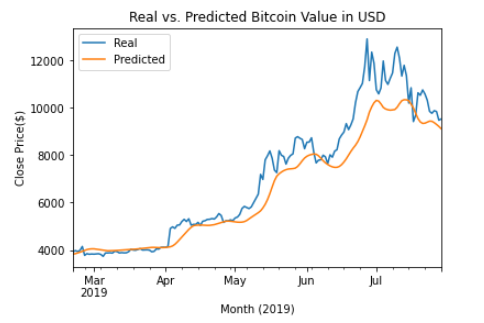
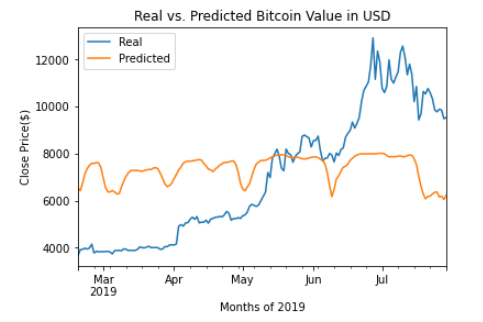

# LSTM RNN - BTC Price Predictor

There were two models that were generated using LSTM (Long short term memory) RNN (Reccurent Neural Networkone) based on the last 10 days Close price and second one based on the Fear and Greed Index of Bitcoin (BTC).

Model 1  - Prediction based on Close Price 

- Lose for this model was : 0.0118
- Model was fitted using epochs = 62, shuffle = False and batch_size = 5

Moel 2 - Prediction based on Fear and Greed Index

- Lose for this model was : : 0.1015
- Model was fitted using epochs = 15, shuffle = False and batch_size = 2

Model 1 performed much better than Model 2 as the Loss on Model is much lower than the Model 2 loss. In Model 2 there was almost no corelation between Actual and Predicted prices for the BTC
